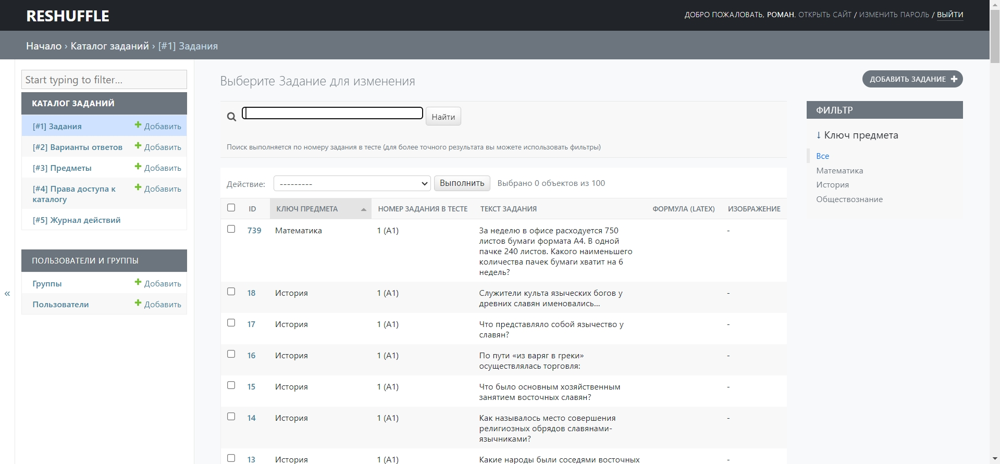

# RESHUFFLE

## О проекте

Ежегодно университет тратит ресурсы (под ресурсами имеются ввиду и персонал, и время, и денежные затраты) на выполнение рутинной и трудоёмкой процедуры создания, обновления и проверки материалов для внутренних вступительных экзаменов, которые представляют из себя альтернативу ЕГЭ и являются неотъемлемой частью большинства ВУЗов. Проект направлен на создание информационной системы, которая позволила бы сократить затрачиваемые ресурсы и ускорить обработку материалов вступительных экзаменов.

## Использование

Установка требуемых зависимостей:
```pip install -r requirements.txt```

Требуемые зависимости:
* asgiref==3.4.1
* Django==4.0
* et-xmlfile==1.1.0
* latex2mathml==3.63.3
* lxml==4.7.1
* openpyxl==3.0.9
* Pillow==8.4.0
* python-docx==0.8.11
* six==1.16.0
* sqlparse==0.4.2
* tzdata==2021.5

Для локального запуска приложения используется команда:
```python manage.py runserver```

## Изображения


Авторизация


Главное меню


Меню создания вариантов


Процесс создания вариантов


Админ панель: задания (список)


Админ панель: задания (детали)


Пример сгенерированного варианта (вопросы)


Пример сгенерированного варианта (ответы)

## Контакты
Если вы хотите помочь в разработке или у вас есть вопросы, вы можете связаться с создателем репозитория ([@rand0lphc](https://t.me/rand0lphc)) в telegram.
